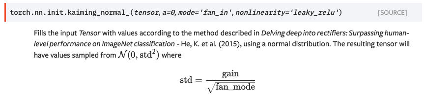

# Double Dueling Deep Q-Learn with Pytorch

**Episode 0**          |  **Episode 350**
:--------------------:|:--------------------:
  |  

## OpenAI Atari solved with DDDQN Pytorch
This repository is an example of Double Dueling Deep Q-Learn network solving the OpenAI Atari environment: **Pong**. The following methods were implemented in this code.  
Basics of Q-learning: https://en.wikipedia.org/wiki/Q-learning  
About the environment: https://gym.openai.com/envs/Pong-v0/ <b/>

## Dueling Double Deep Q - learning
Like the standard DQN architecture, we have convolutional layers to process game-play frames. From there, we split the network into two separate streams, one for estimating the state-value and the other for estimating state-dependent action advantages. After the two streams, the last module of the network combines the state-value and advantage outputs.  [source: https://towardsdatascience.com/dueling-deep-q-networks-81ffab672751]  
 
 
**Architecture** 
 
[soruce:https://www.freecodecamp.org/news/improvements-in-deep-q-learning-dueling-double-dqn-prioritized-experience-replay-and-fixed-58b130cc5682/]

## Softmax action selection
During training and testing of the algorithm I found the best way to tackle exploration - exploitation dilemma is to use a softmax action selection with decreasing temperature. 
Although epsilon greedy action selection is an effective and popular means of balancing exploration - exploitation in reinforcement learning, one drawback is that when it explores it chooses equally among all actions. This drawback can be corrected by using a probability based action selection algorithm, like the softmax action selection implemented in this repository. 
**The softmax action selection formula** 
 
[source: see research papers below] 
With the temperature continuously dropping, the action selection drops from 80% exploration down to approx. 10% exploration at the end of the training. The Agent learns much faster given that even if the action selection is not greedy, it is based on probabilities.

## Prioritised experience replay (PER)
Experience replay lets reinforcement learning agents remember and reuse experiences from the past. Without prioritisation, experience transitions were uniformly sampled from a replay memory. However, this approach simply replays transitions at the same frequency that they were originally experienced, regardless of their significance. The prioritised experience replay essentially gives weights to different experiences based on their importance in the learning process, speeding up the learning process and making it more efficient. PER, generally, can be achieved in two ways: ranking and stochastic prioritisation. The repository demonstrates a stochastic method implemented as show below: 
 
[source:see research papers below]

## Results
There are three metrics which I used to monitor the performance of the Agent:
1. The Softmax action selection (Boltzmann score, "epsilon" on the left y axis below) shows what was the exploration rate during training. This Doesn't mean that the Agent selected a random action at the beginning of the training session, but it shows how many times the Agent chooses other than the most-optimal Action. 
2. Scores: in Pong the maximum score is 21 points, while the lowest score one can receive is -21. 
3. Loss: As part of the double architecture, I sat the weight-share between Primary network and Target network to 10,000 steps. As we can see on the Loss values, this frequency proven helpful to minimize the Loss. 

  
As you can see from the scores, the Agent basically solved this environment at the end of the training period. 

## Notable Hyperparameters
- Weight transfer between Primary and Target networks: 10,000 Steps
- Episodes Training: 350
- Batch size: 32
- Temperature Max: 0.2
- Temperature Min: 0.0004
- Temperature Decay 1: 1e-6
- Temperature Decay 2: 1e-8
- Learning Rate: 0.0001
- Alpha (PER related): 0.7
- Beta (PER related): 0.4
- Beta Decay (PER related): 0.001
- Memory Size: 70,000
- Loss function: Smooth L1 Loss (a.k.a Huber Loss) [See: https://pytorch.org/docs/stable/generated/torch.nn.SmoothL1Loss.html]
 
- Weight Initialization: bias = false for Convolutional Layers; while I used He initialization(fan out!) [See: https://pytorch.org/docs/stable/nn.init.html]
 

I used RELU activation functions.

## Prerequisites
* OpenAI gym
* Numpy
* Pytorch
* Collections
* Cv2
* Matplotlib

This network was trained in Google Colab environment used GPU (Cuda), the code is omptimalised for CUDA environment. 

## Links to research papers and other repositories
Base structure: https://web.stanford.edu/class/psych209/Readings/MnihEtAlHassibis15NatureControlDeepRL.pdf  
Softmax action selection: https://arxiv.org/pdf/1903.05926.pdf  
Prioritised experience replay: https://arxiv.org/pdf/1511.05952.pdf  
Inspired by: https://github.com/philtabor/Deep-Q-Learning-Paper-To-Code  
This code also uses parts of the OpenAI Baselines: https://github.com/openai/baselines  

## Next steps
- Implement an A2C architecture to handle more complex environments with continuous action space.
